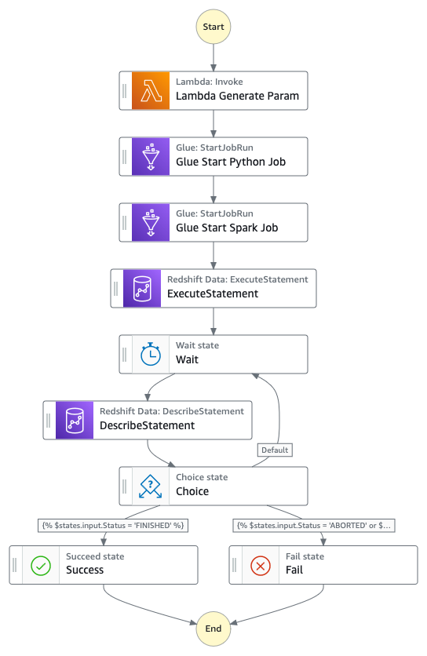

# AWS Step Functions Data Pipeline with Parameterized Jobs

A serverless data pipeline orchestration solution that coordinates AWS Lambda, Glue, and Redshift services using Step Functions to execute parameterized ETL jobs with unique job IDs for tracking and monitoring.

This project implements a robust data processing workflow using AWS Step Functions to orchestrate multiple AWS services. The pipeline generates unique job IDs, executes both Python and Spark-based Glue jobs with these IDs, and records execution details in Redshift. The solution provides end-to-end traceability of data processing tasks through consistent job ID propagation across all pipeline stages.

The main features include:
- Automated job ID generation using Lambda with timestamp and UUID
- Parameterized Glue jobs supporting both Python and Spark environments
- Integrated Redshift logging for job tracking
- Built-in retry mechanisms for error handling
- Synchronous job execution monitoring

## Data Flow

The pipeline orchestrates data processing by generating a unique job ID, passing it through multiple processing stages, and logging execution details in Redshift.



Component Interactions:
1. Lambda generates a unique job ID using timestamp and ID
2. Step Functions passes job ID to Glue Python job via Arguments parameter
3. Python Glue job processes data using the job ID
4. Once finished, then Step Functions will pass the job ID to Spark Glue job 
5. Spark Glue job performs ETL operations using the job ID
6. Step Functions executes Redshift query using the job ID
7. State machine monitors Redshift query execution status
8. Pipeline completes with success or failure based on component status

## Infrastructure

Lambda Functions:
- `generate-param-lambda`: Python 3.8 function for generating unique job IDs

Glue Jobs:
- `job-python-param`: Python shell job for initial data processing
- `job-spark-param`: Spark ETL job for advanced data transformations

Redshift:
- Cluster: `[rs-cluster-identifier]`
- Database: `[rs-dbname]`
- Secret: `[secrets-manager-arn-for-redshift]`

Step Functions:
- State Machine: Orchestrates the entire pipeline with retry logic and error handling
- We are using JSONata to pass parameters across steps

## Repository Structure
```
datapipeline-param-stepfunctions/
├── generate-param-lambda.py     # Lambda function for generating unique job IDs
├── glue-job-python-param.py     # Python-based Glue job with parameter support
├── glue-job-spark-param.py      # Spark-based Glue job with parameter support
└── Param-Step-Function.asl.yaml # Step Functions state machine definition
```

## Usage Instructions

### Prerequisites
- AWS Account with appropriate permissions
- AWS CLI configured with necessary credentials
- Access to AWS services:
  - AWS Lambda
  - AWS Glue
  - Amazon Redshift
  - AWS Step Functions
  - AWS Secrets Manager


